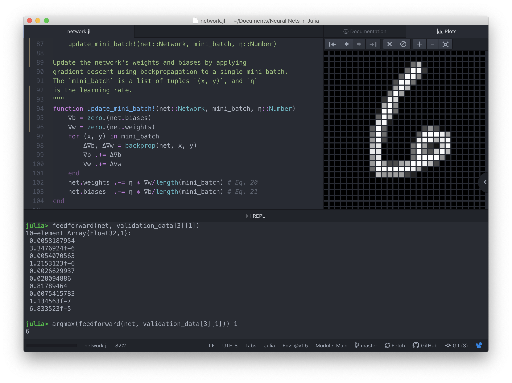

# NNDL-Julia
Implementation of [Michael Nielsen's neural network code](https://github.com/mnielsen/neural-networks-and-deep-learning/blob/master/src/network.py) in Julia.
Uses the [MNIST dataset](https://en.wikipedia.org/wiki/MNIST_database) from [MLDatasets.jl](https://github.com/JuliaML/MLDatasets.jl).

